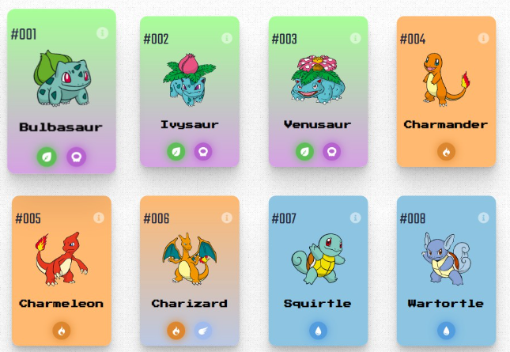

   git clone <URL_DO_SEU_REPOSITORIO>
   cd firts-project-react
   ```

2. **Instale as dependências:**
   ```bash
   npm install
   # ou
   yarn install
   ```

3. **Inicie o servidor de desenvolvimento:**
   ```bash
    npm start
   # ou
   yarn start
   
   ```

   Exemplo:

   
